# DevPlayCloud

Sumérgete en el juego de desarrollo en la nube. Crea y prueba tus proyectos web en un entorno seguro y escalable utilizando tu propio servidor Linux en AWS. Con Amazon Web Services (AWS), puedes aprovechar la potencia y flexibilidad de la nube para llevar tu desarrollo al siguiente nivel.

En este tutorial, te guiaré a través de los pasos para crear un servidor en AWS utilizando el servicio de Amazon EC2 (Elastic Compute Cloud). EC2 te permite lanzar y administrar servidores virtuales en la nube de AWS, proporcionándote una plataforma robusta y confiable para ejecutar tus aplicaciones.

¡Experimenta, itera y perfecciona tus habilidades de desarrollo en la nube! Sigue los pasos a continuación y estarás en camino de tener tu propio servidor en AWS.

## A continuación, puedes encontrar los pasos para crear un servidor en AWS

### Paso 1: Crear una cuenta de AWS

Dirígete al sitio web de AWS (<https://aws.amazon.com/es/>) y haz clic en "Crear una cuenta gratuita" si aún no tienes una cuenta. Sigue los pasos para crear una cuenta de AWS.
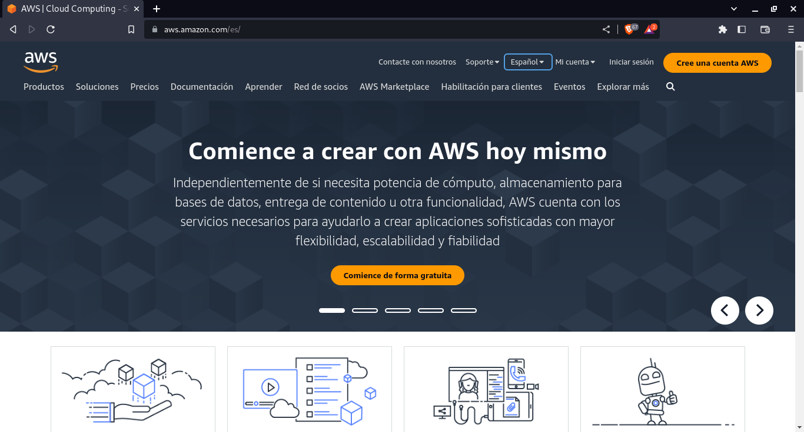

### Paso 2: Iniciar sesión en la Consola de administración de AWS

Una vez que hayas creado tu cuenta de AWS, inicia sesión en la Consola de administración de AWS en <https://console.aws.amazon.com/>. Ingresa tus credenciales de inicio de sesión.
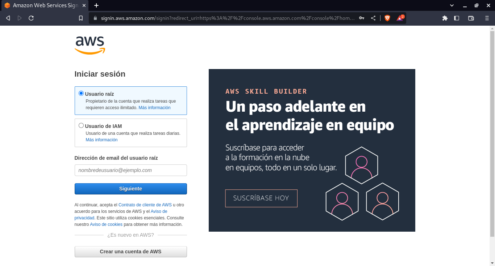

### Paso 3: Acceder al servicio de EC2

Una vez que hayas iniciado sesión, busca y selecciona "EC2" en la consola de administración de AWS. Esto te llevará al panel de control de EC2.
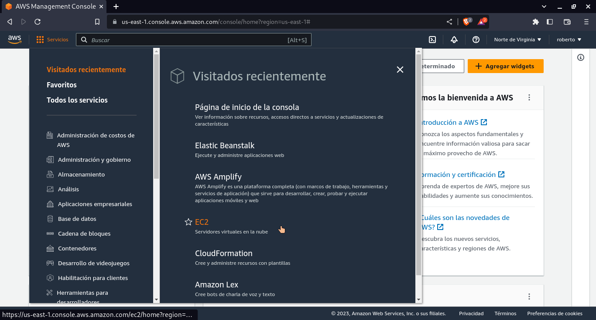

### Paso 4: Crear una instancia de EC2 (servidor virtual)

Explora el menú lateral izquierdo y desplázate hacia abajo hasta encontrar la sección "Instancias". Puede tener un icono representativo o simplemente estar etiquetada como "Instancias".
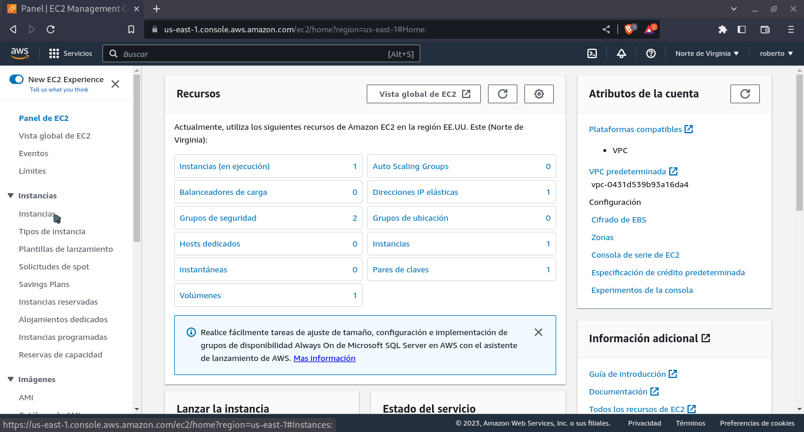
Despues en el botón "Lanzar instancias" para comenzar a crear una instancia de EC2. A lo largo del proceso, se te presentarán varias opciones de configuración.
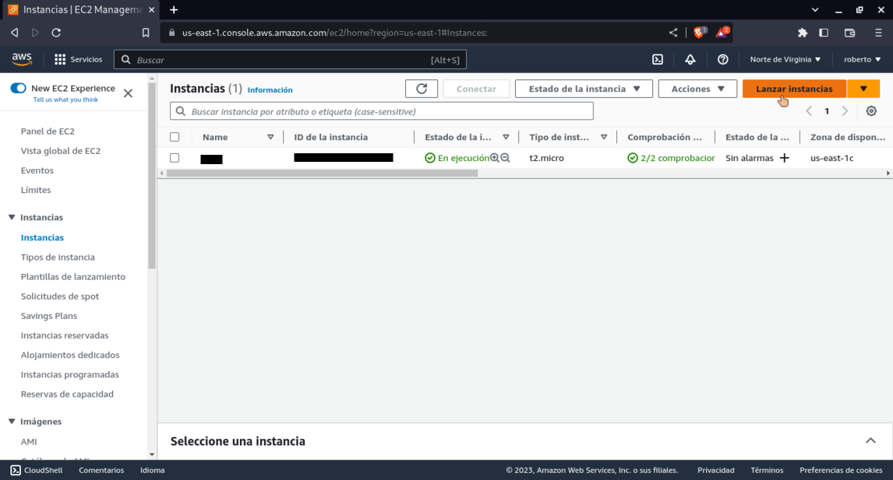

### Paso 5 : Selecciona el nombre de la instancia

En la primera sección, encontrarás un campo para ingresar el nombre de la instancia. <br>
Haz clic en el campo de texto etiquetado como "Nombre de la instancia" o "Nombre" para seleccionarlo.<br>
Escribe un nombre descriptivo para tu instancia. Puede ser cualquier nombre que te ayude a identificar fácilmente la instancia en el futuro.<br>
Asegúrate de elegir un nombre único y significativo, ya que esto te ayudará a administrar y organizar tus instancias de EC2 de manera más eficiente.
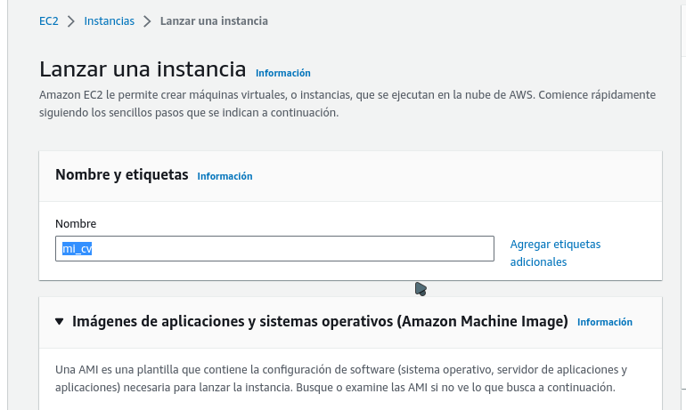

### Paso 5: Seleccionar una imagen de Amazon Machine (AMI)

Elige una AMI que contenga el sistema operativo Linux de tu preferencia. AWS ofrece una variedad de AMIs preconfiguradas para diferentes distribuciones que contenga el sistema operativo de tu preferencia, como Ubuntu que es apto para la capa gratuita de AWS. <br>
Asegúrate de seleccionar la versión y la región correctas para satisfacer tus necesidades.
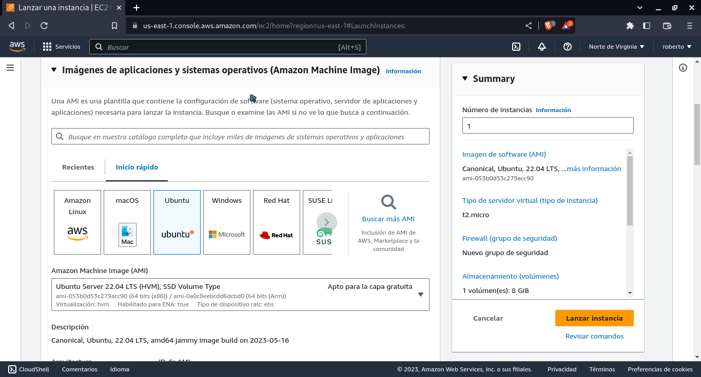

### Paso 6: Seleccionar el tipo de instancia

Selecciona el tipo de instancia que mejor se adapte a tus necesidades. Las instancias de EC2 vienen en diferentes tamaños y capacidades, lo que te permite escalar verticalmente según tus requisitos. <br>
Para aprovechar la capa gratuita de AWS, puedes optar por el tipo de instancia que se encuentra dentro de los límites y recursos gratuitos. <br>
Asegúrate de revisar las especificaciones y características de cada tipo de instancia para elegir la opción adecuada según tus necesidades de rendimiento y capacidad.
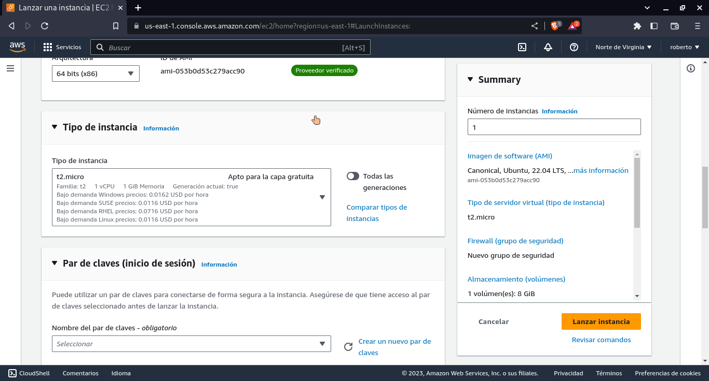

### Paso 7: Crear o seleccionar un par de claves (key pair)

Crea o selecciona un par de claves (key pair) para acceder de forma segura a tu instancia de EC2 mediante SSH. Guarda el archivo de clave privada en un lugar seguro.
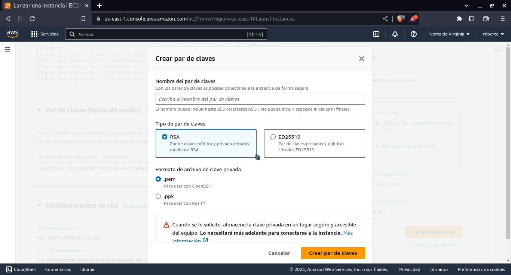

### Paso 8: Configurar reglas de seguridad (grupos de seguridad)

Configura las reglas de seguridad para tu instancia mediante la creación de grupos de seguridad. Estos grupos controlan el tráfico de red permitido hacia tu servidor.
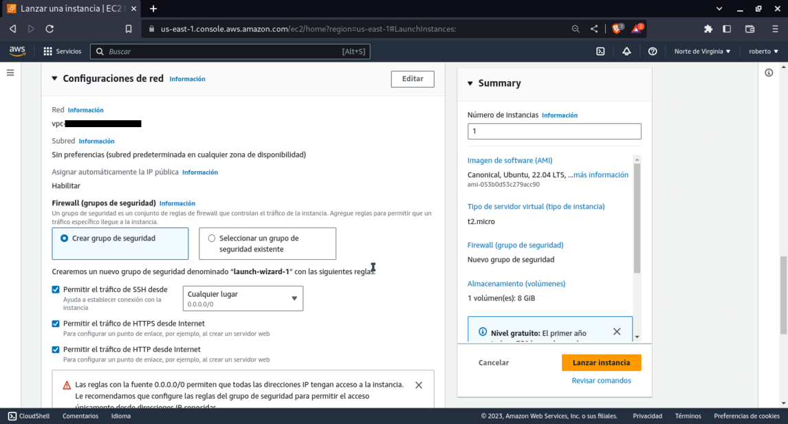

### Paso 9: Configurar almacenamiento

En esta sección, encontrarás opciones para configurar el almacenamiento de tu instancia de EC2. Puedes agregar, modificar o eliminar volúmenes de almacenamiento según tus necesidades. <br>
Para la capa gratuita de AWS, ten en cuenta que existe un límite de 30 GB para el almacenamiento. <br>
Para configurar el almacenamiento, utiliza la interfaz proporcionada para ingresar el tamaño del volumen en gigabytes (GB) o seleccionar una opción predefinida. <br>
Asegúrate de ajustar el tamaño del almacenamiento de acuerdo con tus requisitos y los límites de la capa gratuita.
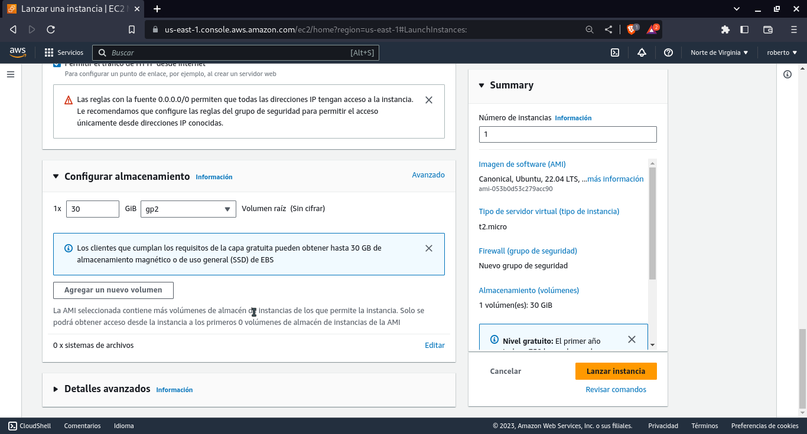

### Paso 10: Revisar y lanzar

Aquí puedes especificar detalles adicionales para tu instancia, como el número de instancias que deseas lanzar, configuraciones de red y opciones de almacenamiento.<br>
Revisa todas las configuraciones que has realizado hasta ahora y haz los ajustes necesarios. Una vez que estés satisfecho, haz clic en "Launch" para lanzar tu instancia de EC2. <br>
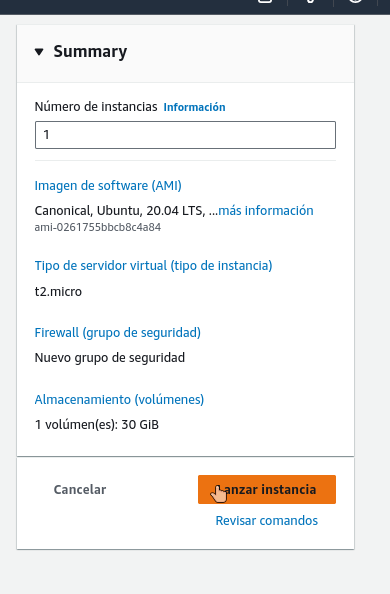

¡Y eso es todo! Con estos pasos, habrás creado tu propio servidor en AWS utilizando Amazon EC2. Ahora puedes comenzar a desarrollar y probar tus proyectos web en un entorno seguro y escalable. ¡Disfruta de las ventajas de la nube y perfecciona tus habilidades de desarrollo en la nube! 
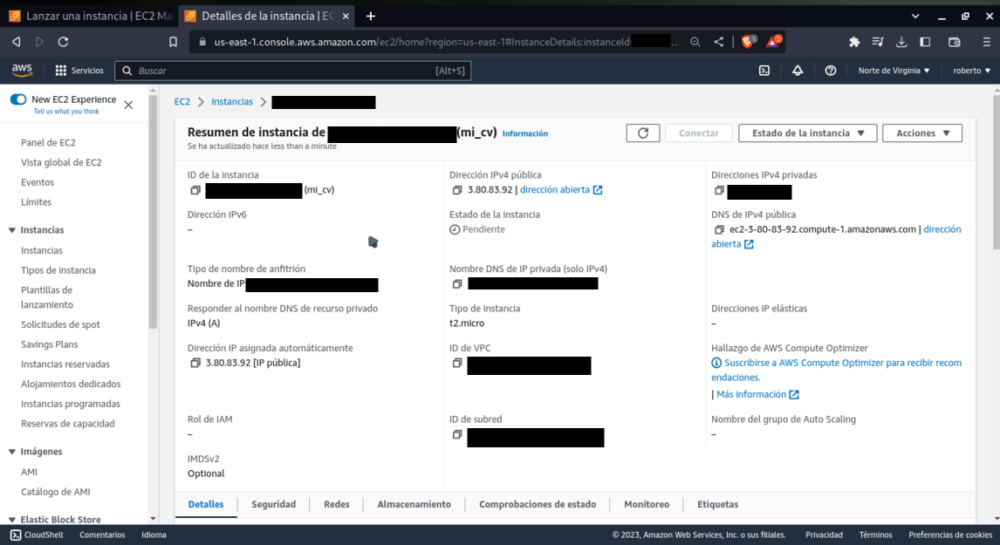

## Configuración de un servicio en el servidor

Una vez que hayas creado tu servidor, es hora de configurar el servicio deseado. En este caso, te guiaré a través de la configuración de un proyecto en React.js + Node.js con MongoDB Atlas en tu servidor. Sigue los siguientes pasos:

### Paso 1: Iniciar el servidor

El primer paso es iniciar tu servidor. Haz clic en el botón "Conectar" <br> 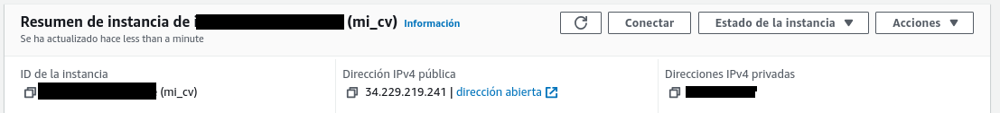 <br> y selecciona la opción de conexión adecuada para tu servidor. En este caso, selecciona EC2 <br> 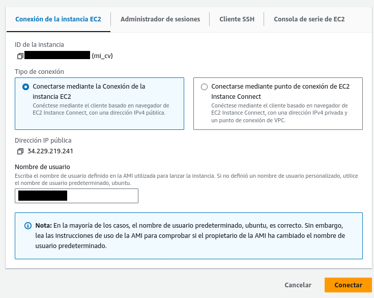. <br> También puedes optar por conectarte mediante SSH utilizando la clave generada.

### Paso 2: Actualizar el sistema

Mantén tu sistema actualizado ejecutando el siguiente comando: 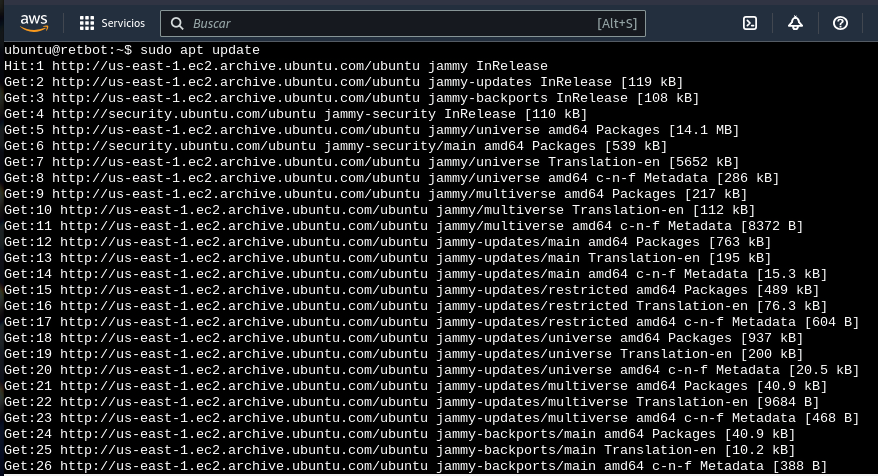

```bash
sudo apt update
```

### Paso 3: Instalar Node.js

Para poder ejecutar tu proyecto de React.js + Node.js, necesitarás tener Node.js instalado en tu servidor. Sigue estos pasos para instalarlo:

1. Instala NVM (Node Version Manager), una herramienta que te permitirá administrar fácilmente las versiones de Node.js.<br> Ejecuta los siguientes comandos: <br> 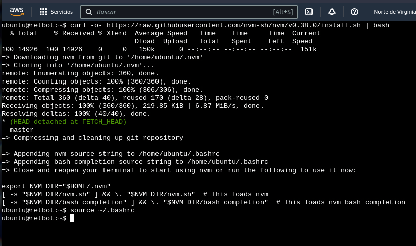

    ```bash
    curl -o- https://raw.githubusercontent.com/nvm-sh/nvm/v0.38.0/install.sh | bash

    source ~/.bashrc
    ```

2. Una vez que hayas instalado NVM, podrás instalar una versión compatible de Node.js. <br>Para instalar la última versión LTS (Long-Term Support) de Node.js, ejecuta el siguiente comando: 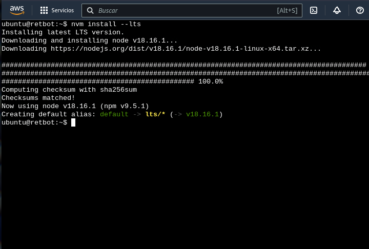

    ```bash
    nvm install --lts
    ```

3. Asegúrate de tener la última versión de NPM (Node Package Manager) instalada ejecutando el siguiente comando: 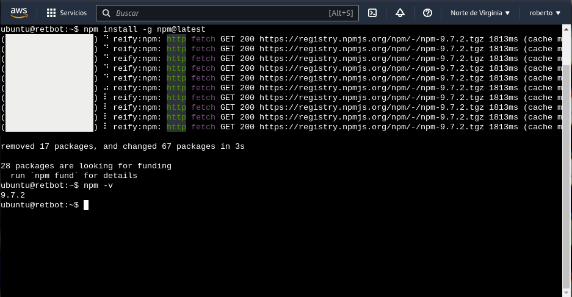

    ```bash
    sudo npm install -g npm@latest
    ```

### Paso 4: Descargar el proyecto a instalar

En este paso, descargarás el proyecto de MERN que deseas configurar en tu servidor. Para ello, sigue estos pasos:

1. Descarga el proyecto desde el siguiente enlace: [Mi CV en la pila MERN](https://github.com/RETBOT/retbot_portafolio)

2. Una vez descargado, navega hasta la carpeta del proyecto en tu servidor.

3. Instala las dependencias necesarias para el proyecto ejecutando el comando `npm installs`.

### Paso 5: Configurar y ejecutar el servidor Node.js

Ahora, vamos a configurar y ejecutar el servidor Node.js en tu servidor. Sigue estos pasos:
 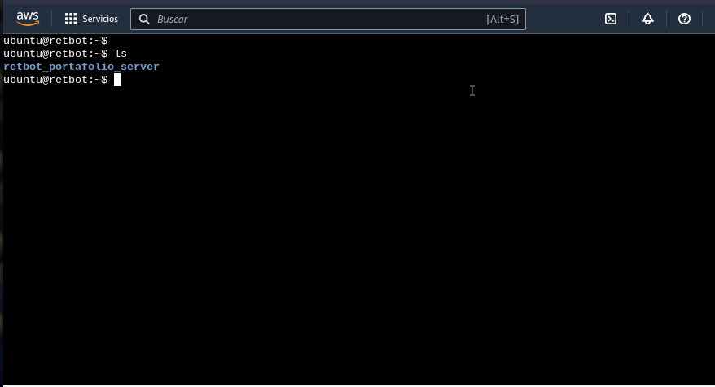

1. Instala las librerías y dependencias necesarias para el servidor ejecutando el comando `npm install` en la carpeta del servidor. 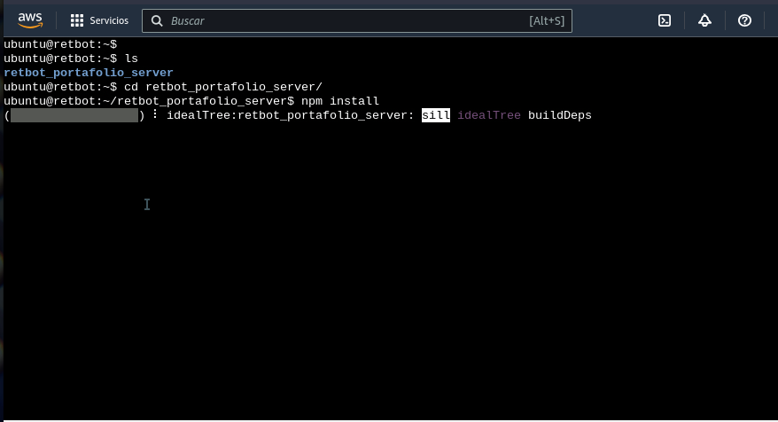

2. Verifica que el servidor esté funcionando correctamente ejecutando el comando `npm start`. Asegúrate de que no haya errores y de que el servidor esté respondiendo adecuadamente. 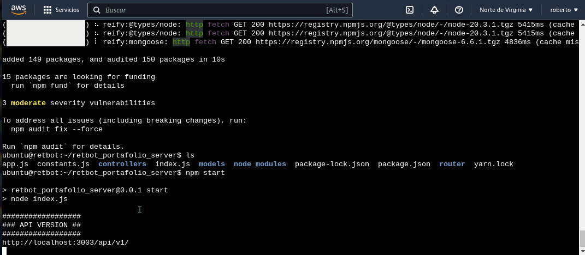

3. Para asegurar que el servidor esté en ejecución de forma permanente, instalaremos la herramienta PM2 (Process Manager 2). <br> PM2 nos permitirá administrar y monitorizar la ejecución del servidor Node.js.<br> 
Ejecuta el siguiente comando para instalar PM2: 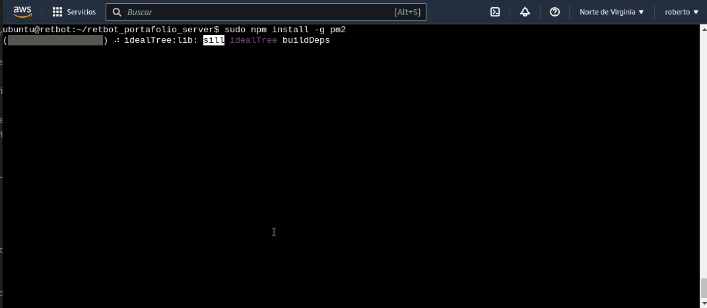

    ```bash
     sudo npm install -g pm2
    ```

4. Inicia el servidor Node.js con PM2 utilizando el siguiente comando: 
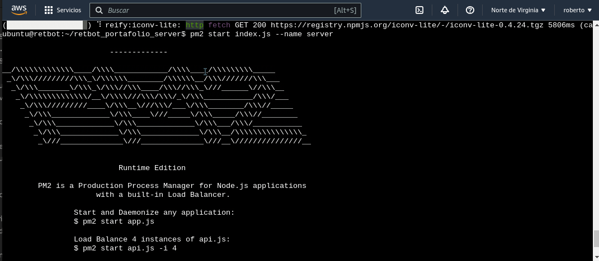 
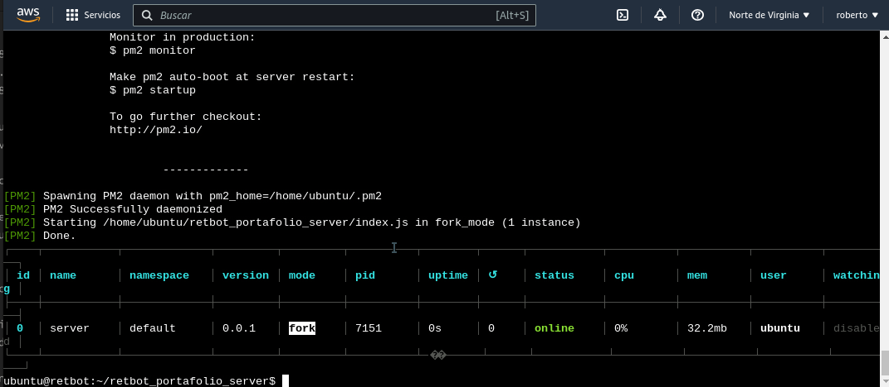

    ```bash
    pm2 start index.js --name server
    ```

5. Ahora, tu servidor Node.js está en ejecución. Si deseas que el servidor se inicie automáticamente al reiniciar el servidor, utiliza el siguiente comando: 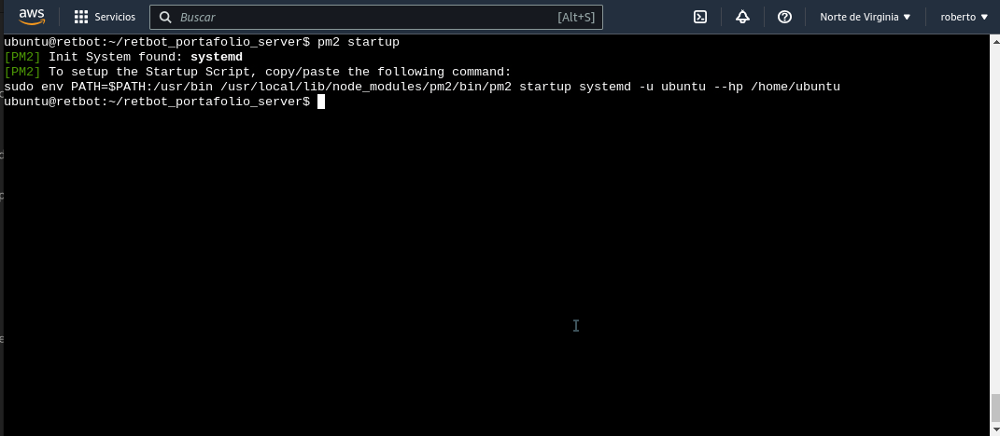

    ```bash
    pm2 startup
    ```

### Paso 6: Abrir el puerto necesario para la API

Asegúrate de que el puerto necesario para la API esté abierto en tu servidor. Sigue estos pasos:

1. Accede a la configuración de seguridad de tu servidor. Puedes encontrarla en los detalles de seguridad, redes o almacenamiento, dependiendo del proveedor de servicios. 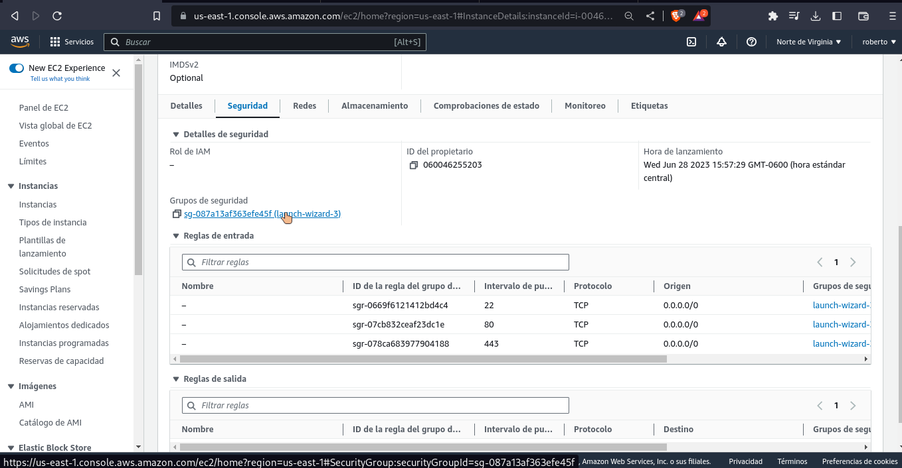

2. Busca la sección de reglas de entrada y selecciona "Editar reglas de entrada". 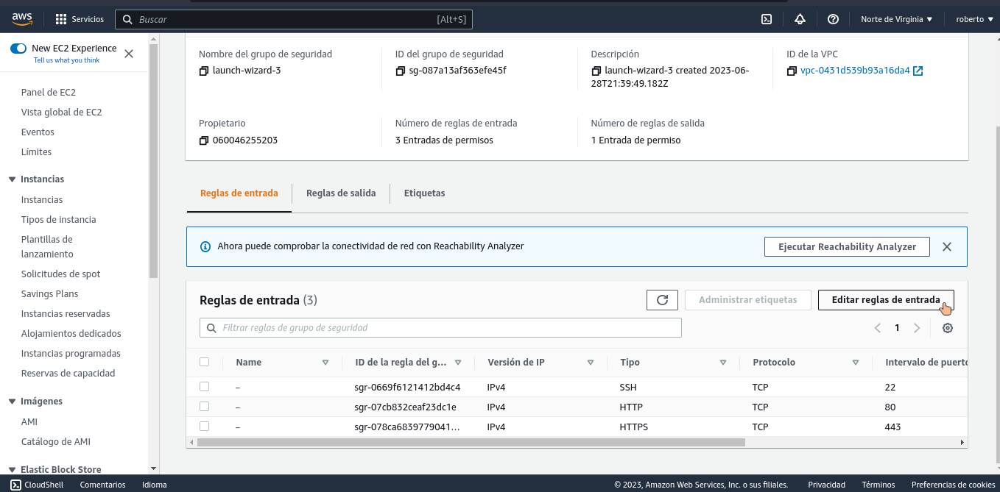

3. Agrega una nueva regla de entrada para el puerto necesario de tu API. En este caso, se utiliza TCP personalizado en el puerto 3003 con el origen configurado como "todos". 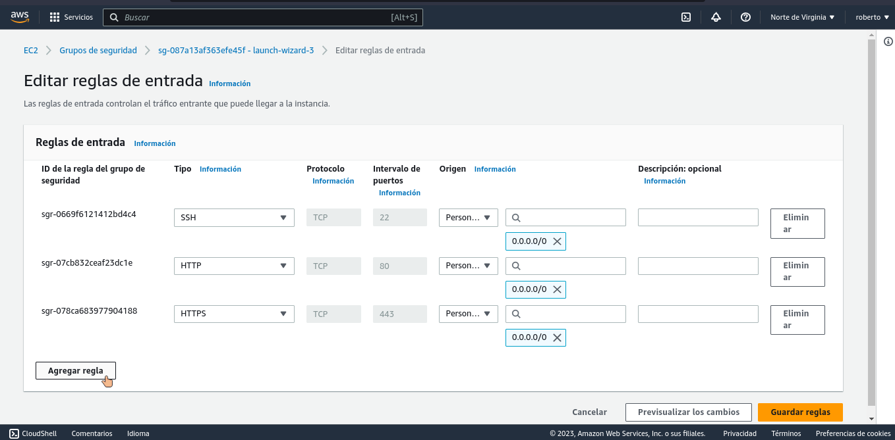 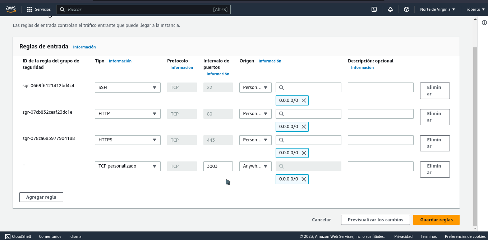

4. Ahora, tu API estará disponible en la dirección IP pública de tu servidor. [Url](http://34.229.219.241:3003/api/v1/comentarios) 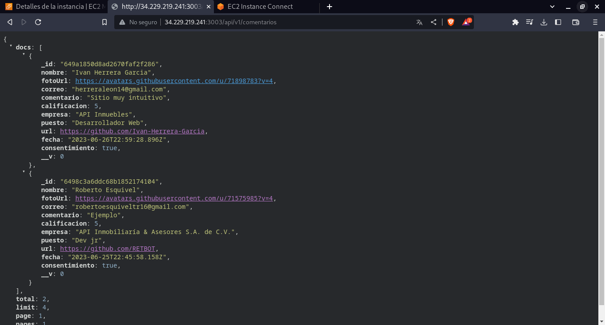

### Paso 7: Configurar y ejecutar el proyecto de React.js

Para configurar y ejecutar el proyecto de React.js en tu servidor, sigue estos pasos:

1. Descarga el proyecto de React.js que deseas instalar en tu servidor.

2. Navega hasta la carpeta del proyecto y ejecuta el comando `npm install --force` para instalar las dependencias necesarias. 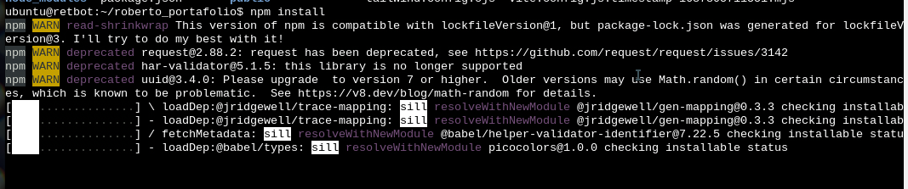

3. Si deseas ejecutar la aplicación en modo de producción, debes generar la versión optimizada de tu aplicación utilizando el script "build". Ejecuta el siguiente comando para generar la versión optimizada: <br> 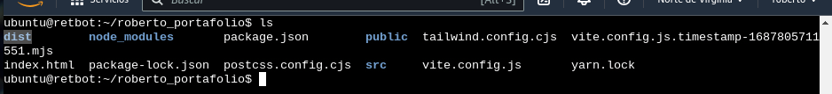

    ```bash
    npm run build
    ```

4. Asegúrate de tener el paquete "serve" instalado globalmente en tu servidor Ubuntu. Si no lo tienes instalado, puedes ejecutar el siguiente comando para instalarlo: 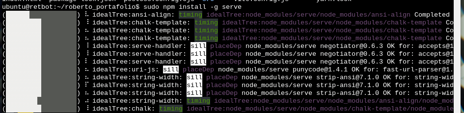

    ```bash
    sudo npm install -g serve
    ```

5. Luego, puedes ejecutar tu aplicación de React.js en modo de producción con el siguiente comando: 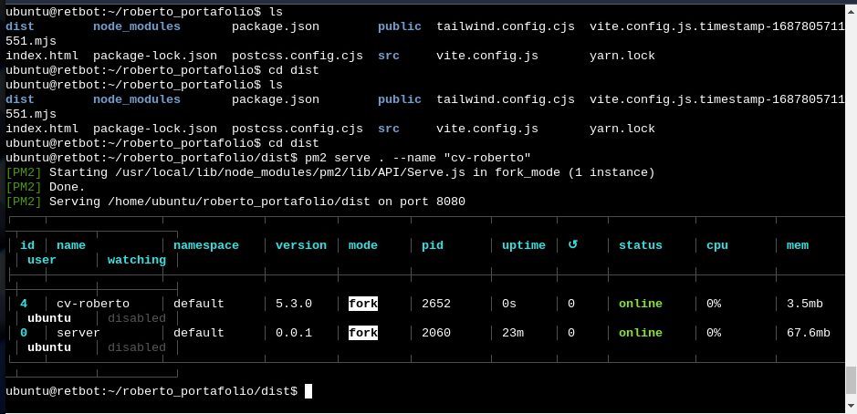

    ```bash
    cd build
    pm2 serve . --name "cv-roberto"
    ```

6. Ahora, tu aplicación de React.js estará en ejecución. Puedes acceder a ella utilizando la dirección IP pública de tu servidor y el puerto 8080. [CV Roberto](http://34.229.219.241:8080/) 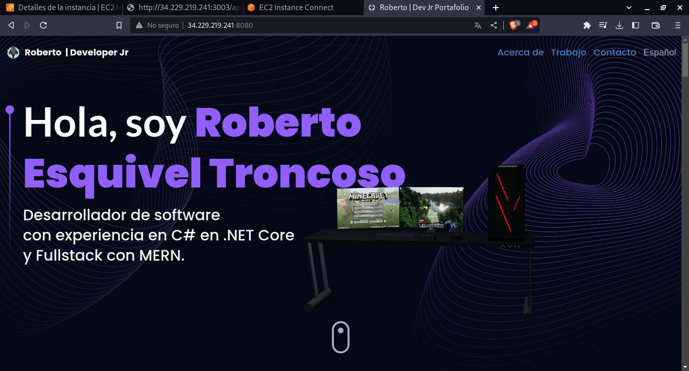

7. Para asegurarte de que el puerto 8080 esté abierto en tu servidor, realiza los mismos pasos descritos en el Paso 6, pero esta vez agrega una nueva regla de entrada para el puerto 8080. 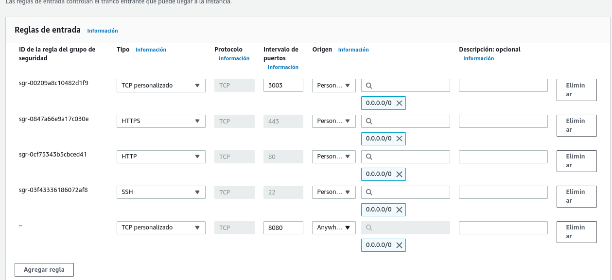

8. Con esta configuración, podrás acceder a tu página web en línea y disfrutar de tu propio sitio web personalizado.

Consejo: Obtén un dominio personalizado y enlázalo con la dirección IP pública de tu servidor para disfrutar de tu propio sitio web bajo un nombre de dominio único. Esta configuración te permitirá acceder a tu página web utilizando tu dominio personalizado.